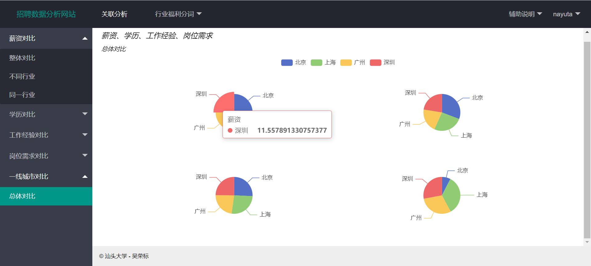

This is a recruitment data analysis website written in spare time. The front end is composed of layui, echart, ES5 and 6, and the back end is composed of Python and Django; The following is a sample drawing.

